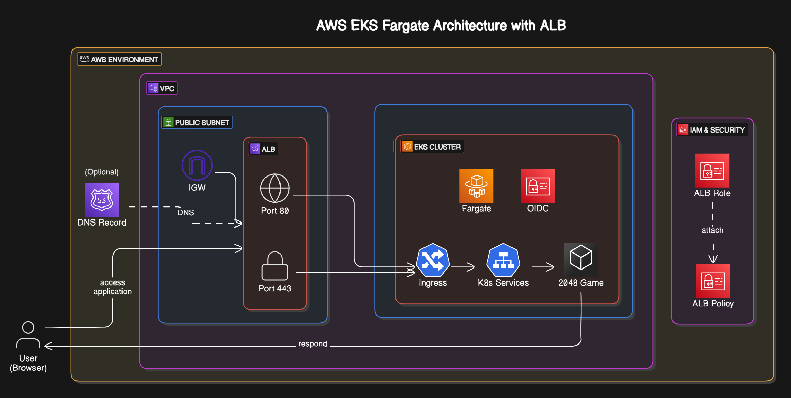

# Kubernetes Application Deployment on EKS with Serverless Fargate and ALB

## Overview
This project demonstrates how to deploy an application on AWS EKS using Application Load Balancer (ALB) for managing traffic and AWS Fargate for running containers without managing servers. Instead of manually provisioning and maintaining worker nodes, we use Fargate as a serverless compute engine to automate scaling and resource allocation. ALB ensures efficient routing and secure access, while IAM roles, OIDC authentication, and Kubernetes ingress rules provide additional security and access control.

## Architecture


Got it! Here's a more concise **How It Works** section:

---

## How It Works

1. **EKS with Fargate**: A serverless Kubernetes cluster is created where pods run on Fargate, removing the need to manage EC2 nodes.

2. **App Deployment**: The 2048 game app is deployed to a specific namespace (`game-2048`) that’s linked to a Fargate profile.

3. **OIDC & IAM**: An IAM role is created and linked via OIDC to securely allow the ALB Ingress Controller to manage AWS resources.

4. **ALB Ingress Controller**: The controller watches for Ingress resources and provisions an ALB to route traffic to the app.

5. **Access via ALB**: The application becomes accessible through the ALB’s DNS endpoint, with optional custom domain support.


## Prerequisites

Ensure the following tools are installed and configured:

- **AWS CLI**: Download and configure the AWS CLI from [here](https://docs.aws.amazon.com/cli/latest/userguide/getting-started-install.html).
  
  After installation, configure it with your AWS credentials:

  ```bash
  aws configure
  ```

- **eksctl**: Install eksctl using the following command:

  ```bash
  curl -LO https://github.com/weaveworks/eksctl/releases/latest/download/eksctl_Linux_amd64.tar.gz
  tar -xzf eksctl_Linux_amd64.tar.gz
  sudo mv eksctl /usr/local/bin
  ```

- **kubectl**: Install kubectl using the following command:

  ```bash
  curl -LO "https://storage.googleapis.com/kubernetes-release/release/$(curl -s https://storage.googleapis.com/kubernetes-release/release/stable.txt)/bin/linux/amd64/kubectl"
  chmod +x ./kubectl
  sudo mv ./kubectl /usr/local/bin/kubectl
  ```

- **Helm**: Install Helm to deploy the ALB Ingress Controller:

  ```bash
  curl https://get.helm.sh/helm-v3.7.0-linux-amd64.tar.gz | tar xz
  mv linux-amd64/helm /usr/local/bin/helm
  ```

  Verify each tool installation:
  ```bash
  eksctl version
  kubectl version --client
  aws --version
  helm version
  ```

   

## Steps

### 1. Set Up an EKS Cluster

Create an EKS cluster using `eksctl`. In this example, we are creating a Fargate-enabled cluster:

```bash
eksctl create cluster \
    --name demo-cluster \
    --region ap-south-1 \
    --fargate
```


After the cluster is created, update your kubeconfig to interact with it:

```bash
aws eks update-kubeconfig --name demo-cluster --region ap-south-1
```


---

### 2. Create a Fargate Profile

To run pods on AWS Fargate, create a Fargate profile for your application. Here, we use the namespace `game-2048`:

```bash
eksctl create fargateprofile \
    --cluster demo-cluster \
    --region ap-south-1 \
    --name alb-sample-app \
    --namespace game-2048
```


---

### 3. Deploy the Application

Deploy your application on the EKS cluster. The example below uses a Kubernetes YAML file to deploy the 2048 game:

```bash
kubectl apply -f https://raw.githubusercontent.com/kubernetes-sigs/aws-load-balancer-controller/v2.5.4/docs/examples/2048/2048_full.yaml
```


---

### 4. Configure OIDC Connector

To enable Kubernetes service accounts to access AWS resources, configure an OIDC provider for your EKS cluster:

Associate the iam-oidc-provider, run the following command:

   ```bash
   eksctl utils associate-iam-oidc-provider \
       --region ap-south-1 \
       --cluster demo-cluster \
       --approve
   ```


---

### 5. Configure ALB Ingress Controller

The ALB Ingress Controller enables you to manage Application Load Balancers for your ingress resources.

#### Step-by-Step ALB Configuration:

1. **Create an IAM Policy for the ALB Ingress Controller**

   Download the policy document from AWS:

   ```bash
   curl -O https://raw.githubusercontent.com/kubernetes-sigs/aws-load-balancer-controller/v2.11.0/docs/install/iam_policy.json
   ```

   Create the IAM policy:

   ```bash
   aws iam create-policy \
       --policy-name AWSLoadBalancerControllerIAMPolicy \
       --policy-document file://iam_policy.json
   ```

   

2. **Create a Kubernetes Service Account with IAM Role**

   Create a Kubernetes service account and associate it with the IAM policy:

   ```bash
    eksctl create iamserviceaccount \
    --cluster=<cluster-name> \
    --namespace=kube-system \
    --name=aws-load-balancer-controller \
    --role-name AmazonEKSLoadBalancerControllerRole \
    --attach-policy-arn=arn:aws:iam::<aws-account-id>:policy/AWSLoadBalancerControllerIAMPolicy \
    --approve
   ```

   

3. **Deploy ALB Ingress Controller**

   Add the Helm repository for the ALB Ingress Controller:

   ```bash
   helm repo add eks https://aws.github.io/eks-charts
   helm repo update
   ```

   

   Install the ALB Ingress Controller:

   ```bash
    helm install aws-load-balancer-controller eks/aws-load-balancer-controller -n kube-system \
    --set clusterName=<your-cluster-name> \
    --set serviceAccount.create=false \
    --set serviceAccount.name=aws-load-balancer-controller \
    --set region=<region> \
    --set vpcId=<your-vpc-id>
   ```

   

   Verify that the deployments are running.
   ```bash
   kubectl get deployment -n kube-system aws-load-balancer-controller
   ```

   
   

---

### 5. Access the Application via ALB

After deploying the ALB Ingress Controller and configuring ingress, verify the ALB:

1. Retrieve the public DNS name of the ALB:

   ```bash
   kubectl get ingress -n game-2048
   ```

   
   You can access your application by navigating to this URL in a browser.

   

2. **(Optional)**: Set up a custom domain by configuring DNS settings in Route53 or your DNS provider. Update the Ingress resource to use your custom domain under the `host` field.

---

### 6. Delete the Cluster

To clean up resources, delete the EKS cluster:

```bash
eksctl delete cluster --name demo-cluster --region ap-south-1
```

---